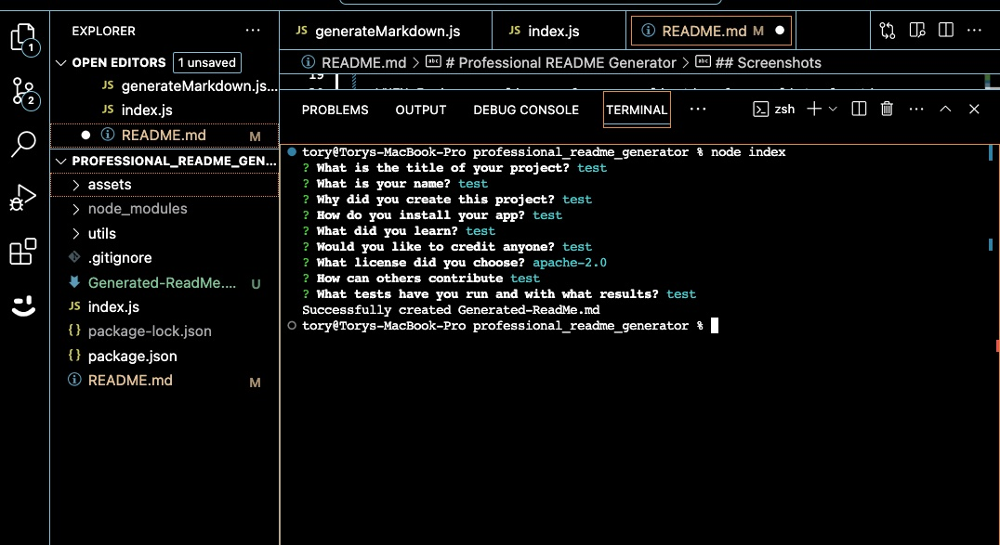
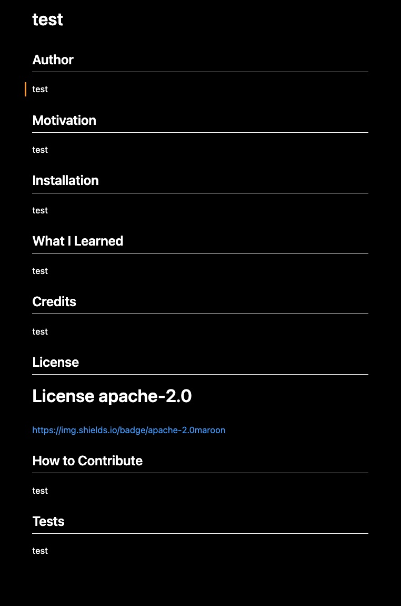

# Professional README Generator
This modules challenge was to use NodeJS and the Inquirer package to generate a README file after a series of prompts are answered.

## User Story
>AS A developer
>I WANT a README generator
>SO THAT I can quickly create a professional README for a new project

## Acceptance Criteria
>GIVEN a command-line application that accepts user input
>WHEN I am prompted for information about my application repository
>THEN a high-quality, professional README.md is generated with the title of my project and sections entitled Description, Table of Contents, Installation, Usage, License, Contributing, Tests, and Questions

>WHEN I enter my project title
>THEN this is displayed as the title of the README

>WHEN I enter a description, installation instructions, usage information, contribution guidelines, and test instructions
>THEN this information is added to the sections of the README entitled Description, Installation, Usage, Contributing, and Tests

>WHEN I choose a license for my application from a list of options
>THEN a badge for that license is added near the top of the README and a notice is added to the section of the README entitled License that explains which license the application is covered under

>WHEN I enter my GitHub username
>THEN this is added to the section of the README entitled Questions, with a link to my GitHub profile

>WHEN I enter my email address
>THEN this is added to the section of the README entitled Questions, with instructions on how to reach me with additional questions

>WHEN I click on the links in the Table of Contents
>THEN I am taken to the corresponding section of the README

## What I Learned
I was happy to get a deeper grasp of NodeJS. I find using Inquirer alot of fun and look forward to using it in future projects. I would like to explore how it can be used in real world applications. I also really like using a seperate util folder to handle the generateMarkdown function. It makes the code easier to read and more organized.

## Screenshots

## Video Demonstration
[demo](https://drive.google.com/file/d/148WcLepRJeS6fZtBci4o9W82ttn4-Q_F/view)

### Source Code
Source code was provided by UofO bootcamp. Thank you to askBCS for their assistance and guidance as well. 

